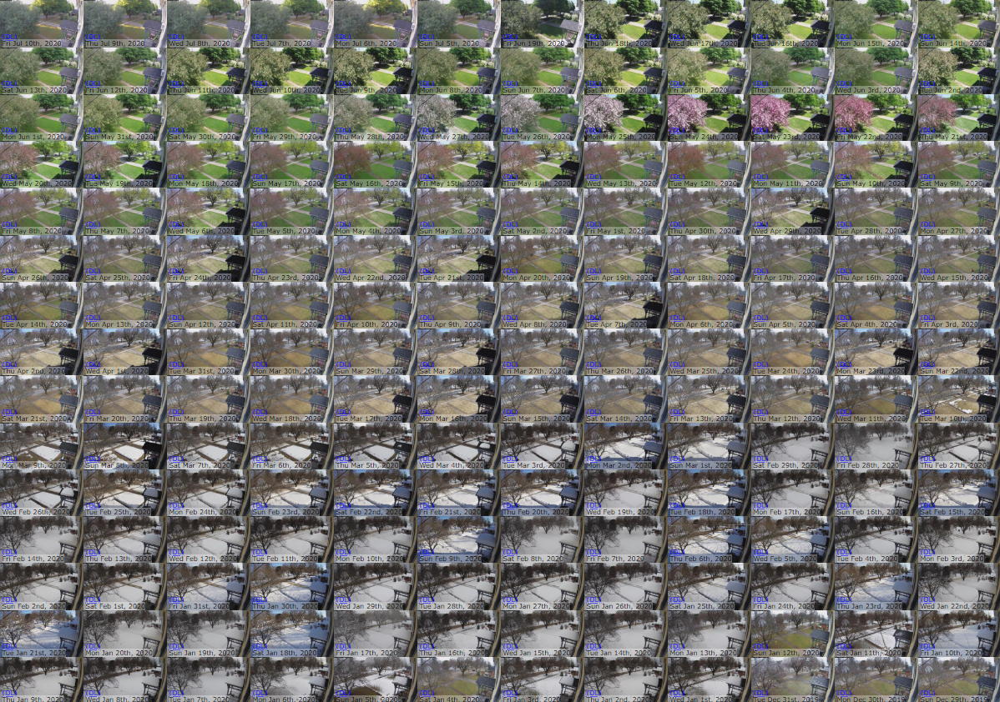

# zoneminder-timelapse
 
Simple scripts to create daily timelapse videos from Zoneminder events and archive them for viewing on the web.


Archived timelapses over the year:<br>


### Requirements

- Zoneminder > 1.34.  I am testing with 1.36.19. 
- Events must be stored as jpegs using the directory scheme which includes the date as a folder within the camera id folder.  This is true if using jpegs in 1.36.
- Sendx Apache mod
- python 3.x

### Viewer
The viewer allows stepping through frames by pausing the video and pressing , and .<br>
Thanks to [https://github.com/allensarkisyan/VideoFrame](https://github.com/allensarkisyan/VideoFrame).  I have included a copy of the js file in the repo.  It should be put in the `skins/classic/js` of Zoneminder.


### Installation
- Download scripts here to your user's home directory (or wherever you like).  I put mine in `/home/tycon/timelapse`.  My user tycon is in the www-data group.
- Set the following variables in `maketl.py`
  - `cams` - a list of camera ids you want to create timelapses for.
  - `tl_destination` - the web directory you want to store the rendered timelapse videos
  -  `log_path` - the location you want to store the script logs
- Set the following variables in `get_frames.py`
   - `event_path` - path to your zoneminder event directory. This dir should contain directories with camera numbers 1,2,3 etc
- Set the following variables in `makeindex.php`
  -  `$tl_destination` - the web directory you want to store the rendered timelapse videos (same as above)
- Set the following variables in `tl.php`
  -  `$tl_destination` - the web directory you want to store the rendered timelapse videos (same as above) 
  -  `$tl_log` - the directory is the tl logs are located.  Same as `log_path` above. 
- Install and enable the sendx apache mod
  - `sudo apt-get install libapache2-mod-xsendfile`
  - `sudo a2enmod xsendfile`
  - Configure the xsendfile mod 
     <br>```sudo nano mods-enabled/xsendfile.load``` 
            
    Should look like (add your own tl_destination path):     
     ```
     LoadModule xsendfile_module /usr/lib/apache2/modules/mod_xsendfile.so
     XSendFile On
     XSendFilePath "/external/zoneminder/tl"
    ```
- Add `tl.php` to `/usr/share/zoneminder/www/skins/classic/views` or where your zoneminder php view files are.

### Running
- Run 
  ```
  python3 /full/path/to/maketl.py
  ```
- Log into Zoneminder and goto `https://[myzoneminderurl]/zm/?view=tl`

### Regenerating previews
If you import timelapse videos and need to regenerate preview images for the web UI or you want to tune which hour the preview image is taken run `previews.py`.  See notes in the file.

### More
I wrote these scripts as a Python replacement for [https://github.com/grapekh/ZoneMinder_TimeLapse](https://github.com/grapekh/ZoneMinder_TimeLapse).  As far as I can tell Zoneminder changed the event storage path structure somewhere along the line and I prefered Python to Bash.  I have done very little testing etc. and there was quite a bit of tinkering to get everything working with Zoneminder.  I tried to focus on speed of the script and good logging.

In the future I would like to improve the php page for displaying the videos (a lot can be done in this area).  In generally the structure of the scripts should also be improved with a single config file and more command line options. 